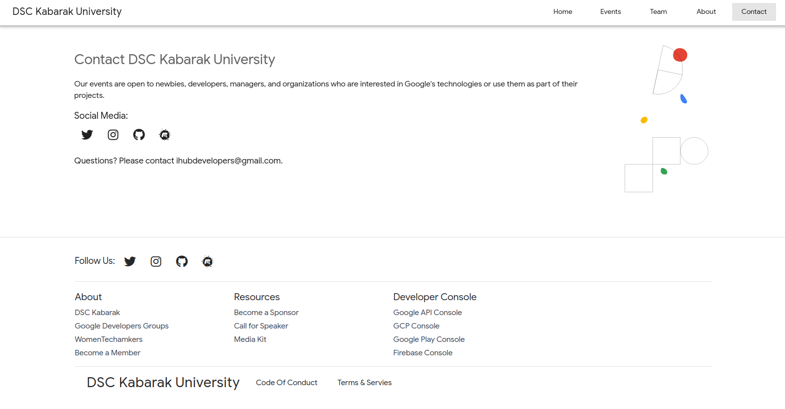

<div class="ui small rounded images">
  
  
</div>

First & foremost, huge thanks to all the contributors, specifially Vrijraj Singh, Google Developer Expert for Firebase & Web for his initial work in the project, I'm standinding in his shoulders, the Giant :)

The project is an inspiration to me as a developer, this made me to quickly pick up on Vuejs and learnt a lot from it. As a result, I started organizing Vuejs Kenya community and worked with very talented and passionate web developers. You can check out more on the community on our, [meetup page](https://www.meetup.com/vue-js-kenya) and [twitter handle](https://twitter.com/kenyavue?lang=en). Much more coming from the community...

The project is based on Vuejs and incorporates some amazing tools, pwa and the meetup API and it's hosted on firebase which offers a wide range of services and features and has a free basic plan with quick and easy integration and setup.

The code design for the project still is the most facinating thing on this project, quite easy to pick up on what has been done and introduce new features into the project.
The project uses state management using Vuex and the framework's router which makes it dead-simple in adopting it.

To ensure that the theme is in line with Google's theme, it makes good use of material-design and Vuetify, which is its component framework for Vue.js.

Before Google switched all it's event management to the new platform at [Google Developers](https://gdsc.community.dev/), it used Meetup platform, and at the time of development of the project, all our community events was managed using the Meetup platform, hence, this project makes use of the meetup API to fetch events information to the users using axios, a promise based client for the browser.
Check this out, 

```js
  fetch(
      "https://cors-anywhere.herokuapp.com/https://api.meetup.com/" +
        MeetupAPI.urlname +
        "/events?&sign=true"
    )
      .then((data) => data.json())
      .then((res) => {
        if (res.length > 0) {
          this.showLoader = false;
          this.showData = true;
          this.eventsData = res;
        } else {
          this.showLoader = false;
          this.notFoundUpcomingEventFlag = true;
        }
      })
```
Then consume it in your template.
There's so much I've left abt this project that thrills and motivates how I approach my coding style.
You can check more on the project here

Source: <a href="https://github.com/DSCKabarak/aura"><i class="large github icon"></i>DSCKabarak/aura</a> <br>
Live Website: <a href="https://dsckabarakuniversity.web.app">GDSC Kabarak University</a>


Follow the links to learn more about 
[Vuejs](https://vuejs.org),
[PWA](https://web.dev/progressive-web-apps/) and
[Meetup-API](https://www.meetup.com/api/)

<br>
<br>


