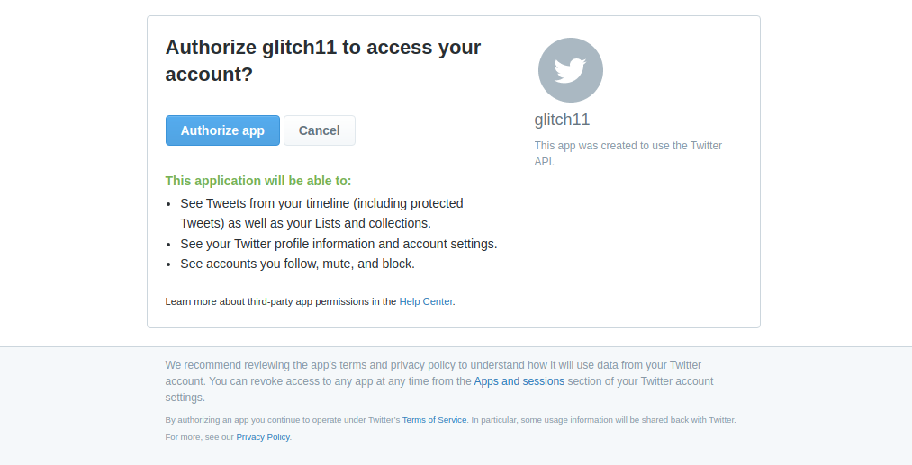

I wanted to try out twitter API, get things rolling pretty fast specifically with Python.. I did quite a background research on the twitter API v2, which is the latest version at the time of writing, I'd saywhich is quite intensive, with over 50 endpoints to analyze how people engage in coversation, as well as enpoints to hide repliess, create polls, tag people, to getting a list of people who liked a given post, and specific status and liking them and much more.

To some extend, twitter limits what developers can do with it's API, with the [Essential access](https://developer.twitter.com/en/portal/petition/essential/basic-info). 

The project makes use of [tweepy](https://docs.tweepy.org/en/stable/) a python library that simplifies the interaction of the twitter API and gets you productive on the fly.
I performed authentication of the application, get a user and their timeline and specific status/post.

```py
  import tweepy
  import webbrowser
  import time
  import pandas as pd
  consumer_key = ''
  consumer_secret = ''
  callback_uri = 'oob'
  auth = tweepy.OAuthHandler(consumer_key, consumer_secret, callback_uri)
  redirect_url = auth.get_authorization_url()
  print(redirect_url)
  webbrowser.open(redirect_url)
  user_pin_input = input("What's the pin value? ")
  user_pin_input
  #get user timeline
  api = tweepy.API(auth)
  user = api.get_user("elonmusk")
  user_timeline = user.timeline()
  user_timeline_status_obj = user_timeline[0]
```

Source: <a href="https://github.com/Phil-Reck/twitterAPI"><i class="large github icon"></i>Twitter API</a>