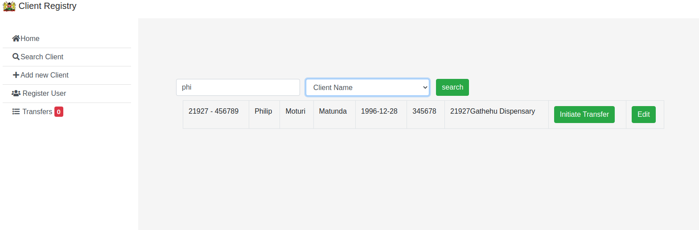
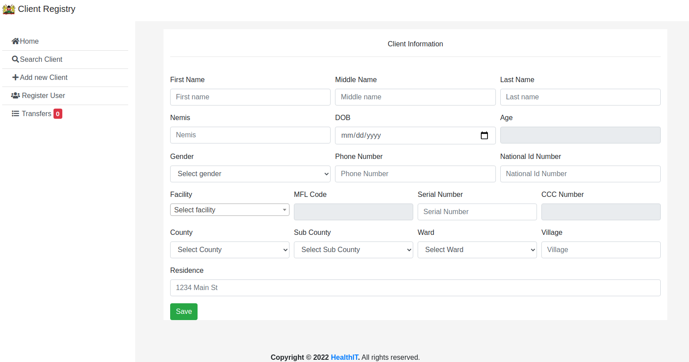

<!--  -->

  
  

Developed with Laravel, this's an API for accessing client's information across different MoH systems and consolidating the records across them.
Acts as a mediator, an API consuming other API's like [Kenya Master Health Facility List](http://kmhfl.health.go.ke/#/home) with all health faclities and community unit in Kenya, with each of them having a unique code and details describing geographical location, administration location, ownership, type and the service offered. 

<!-- 
 -->

<!-- <pre> -->
<!-- You open your eyes, and you are greeted by an unfamiliar ceiling.
Startled, you get to your feet and quickly scan your surroundings. It's
dark except for the stream of light coming from a crack on the only boarded
window in the room. You try to peek through the crack, but you cannot see
anything. You wonder where you are and who could have possibly brought you here. -->

<!-- <--------------------help------------------------> 
<!-- Enter quit or one of the following commands -
Weld light look walk pickup inventory help h ? -->
<!-- <------------------------------------------------>
<!-- 
look
The room is a picture of decay with only a faded number identifying it as room-4. The bed you were
 lying on is stained with what looks like dried blood. Could it be your blood? No - it is not. The
 only way out of the room aside from the door to the corridor is a window that is boarded shut. It
 looks like it has been like that for decades. There is a door going west from here. You see a candle
 on the floor. You see a match on the floor.

pickup candle
- you are now carrying the candle -

pickup match
- you are now carrying the match -

light match candle

The candle is now lit. It illuminates everything in the room.

walk west
The corridor is lit with the candle. It is so long that you cannot see to the end. You notice that
 there are words written on the wall. There is a door going east from here. There is a way going north
 from here. There is a door going south from here. -->
<!-- </pre> -->

Source: <a href="https://github.com/uonafya/Client-Registry-1/"><i class="large github icon "></i>client registry</a>

