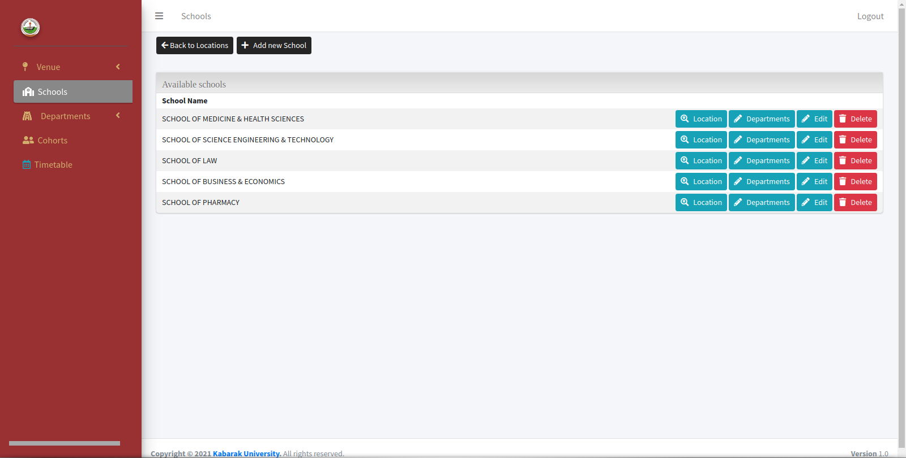
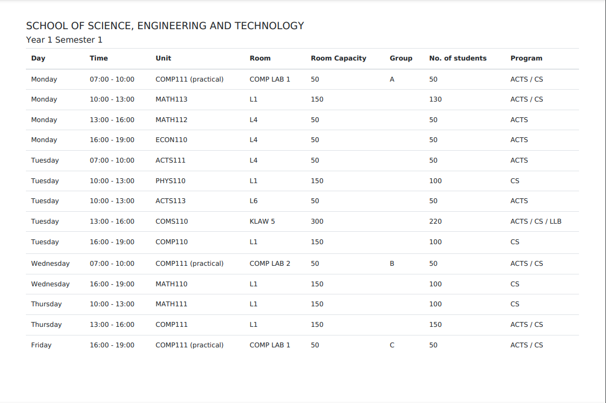

  
  

The project is built with Laravel with AdminLTE for the frontside templating.

The system is built for a University based setup for the generation of a semeter long timetable based on parameters such as the Venue classes will be taking place, the School and Department under which Diploma and Degree Programs belong to, the Units each Program has, the time allocation for each Unit and the Room and Laboratory each unit will be taking place at for a given period of the week.
The system then generates a timetable, which factors in the number of days classes are carried out within the institution, the cohort that are doing that semester and leaves the ones on break.

For this project, I was part of a team of four where I took part in the implementation of some of the CRUD functionality, addition of new features in the project, setting up the server environment CI/CD and customizing the user interface, debugging  and performing unit test for current and newly developed features.

The system implements some awesome laravel features; authentication of users based on roles, php unit tests, validations, file management, events and listeners, queues and jobs of the generation with advanced eloquent and DB operations and Websockets.

Follow the links to learn more about 
[Laravel](https://www.laravel.com),
[AdminLTE](https://www.adminlte.io/)

